# Project Icarus

## Overview

Developed as the Capstone project in a sixteen week coding bootcamp, Project Icarus is an image sharing site designed to allow for easy uploading and sharing of images of any type. It is designed to be fully responsive and was built using HTML & CSS, utilising Bootstrap5 for the interface, and Django for the backend. The current name, Project Icarus was originally meant to just be a placeholder and meant to express my feeling that I'm flying just that little bit too close to the sun with this project. I've decided to embrace both the feeling and the name, though!

# Table of Contents

[Overview](#overview)  
[Table of Contents](#table-of-contents)  
[UX Design](#ux-design)  
[User Stories](#user-stories)  
[Wireframes](#wireframes)
[Brand Identity](#brand-identity)  
[Deployment](#deployment)  
[AI Usage Disclosure](#ai-usage-disclosure)  
[Testing](#testing)  
[Future Additions](#future-additions)

# Feature Overview
Project Icarus aims to provide a simple, calm image sharing platform in the vein of the early days of Instagram. With its mellow colours, rounded corners, and intentionally limited to sharing photos only, it is meant as an antidote to today's ceaseless onslaught of rage-based engagement bait. As such, it focusses on providing a stage for single photographs and a platform for creators and visitors to enter into a meaningful dialogue about said photo.

The app is fully responsive and the following features have been implemented:

- User Registration
- Login & Logout functionality
- Post creation & image upload for registered users only
- Comment creation for registered users only
- Post & comment deletion for registered users only
- "My Posts" page to provide registerd users weith a single location to view and edit their post.
- Intuitive app navigation
- View post functionality for all users

[Home](#overview)

# UX Design

The primary aim of Project Icarus is to provide a calming and intentional platform to upload and share their photos. As such, the interface has been stripped back to its basics, 

[Home](#overview)

## Design Statement

The design aims to generate a calm ambience, using pastel greens and yellows to create a soothing atmosphere. The design also avoids the use of sharp corners to further enhance this calm atmosphere. This design language is implemented throughout the site, with only the login and signup pages deviating from this somewhat. Since Project Icarus is a photo sharing website, the photos themselves have pride of place, both on the main view, the 'Image Feed', and on the individual image view. 

[Home](#overview)

## User Stories
The full project board containing all uswer stories and their MoSCoW classifiction, including those that were not implemented or may form the basis for future further developments of Project Icarus can be found here: [Project Board - Project Icarus](https://github.com/users/thomil13/projects/6/views/1)

### Account Creation & Management
- As a user, I want to register an account so that I can upload and comment on images.
- As a user, I want to log in securely so that I can access my account and content.

### Content Access & Interaction
- As a registered user, I want to upload images so that I can share them with others.
- As a user, I want to browse approved images so that I can see what others have shared.
- As a registered user, I want to view a list of only my own posts so that I can easily manage my content
- As a registered user, I want to edit or delete my own uploaded images and comments so that I can control my contributions.
- As a user, I want to comment on images so that I can engage with other users’ content.

### Administration
- As an admin, I want to review and approve uploaded images so that only appropriate content is visible to users.
- As an admin, I want to review and approve submitted comments so that discussions remain respectful and safe.

[Home](#overview)

## Wireframes

### Home Page
<table><tr><td>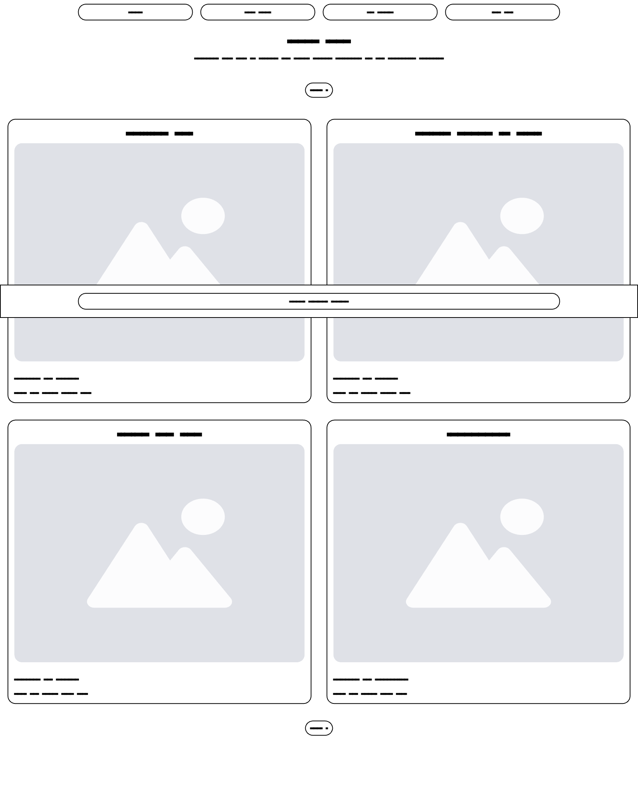</td><td>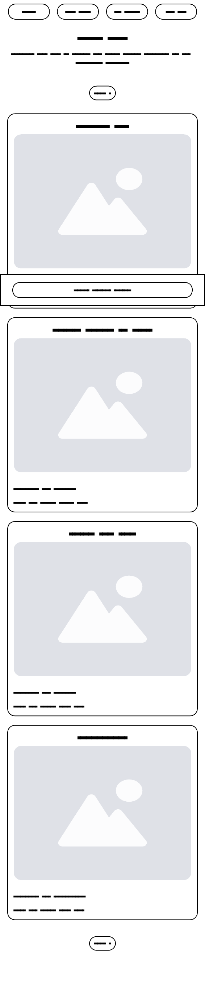</td></tr></table>

### About
<table><tr><td>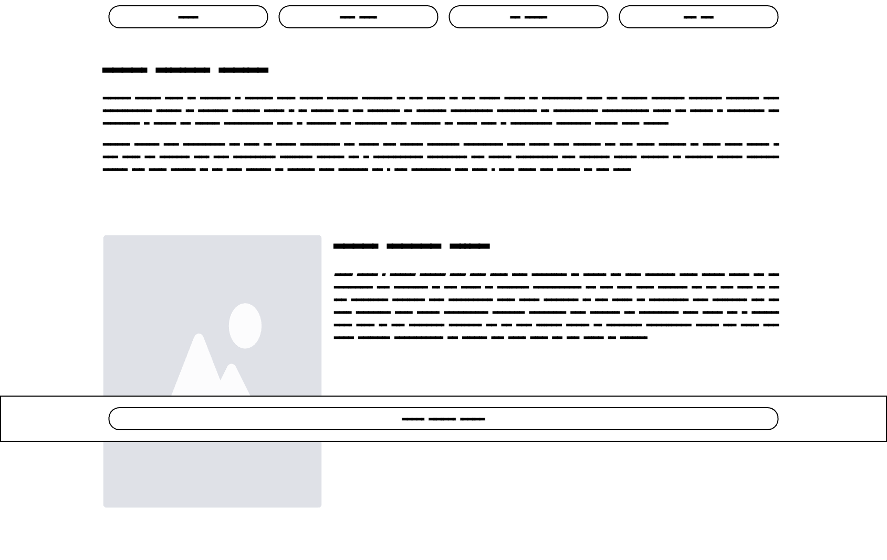</td><td>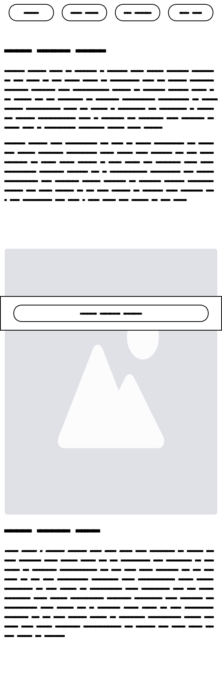</td></tr></table>

### New Post Page
<table><tr><td>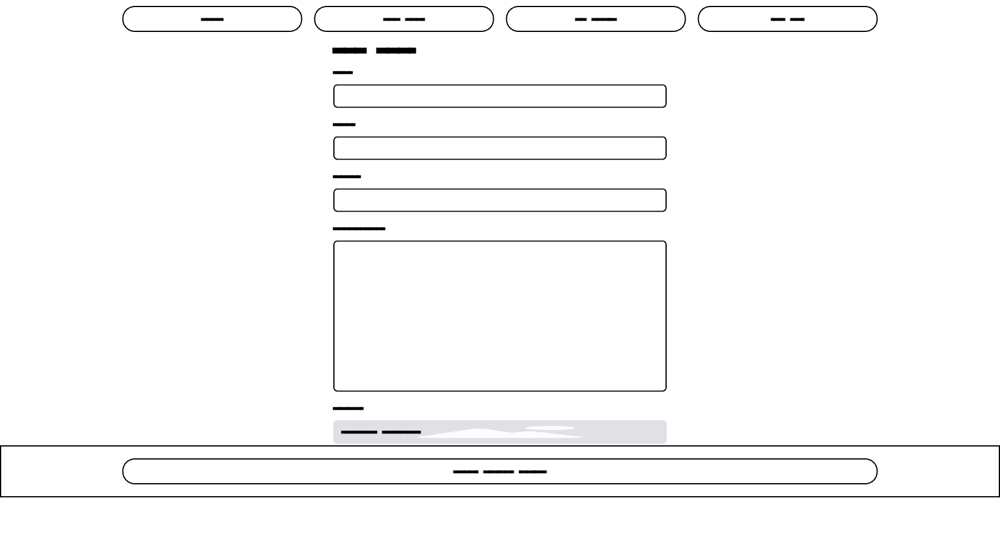</td><td>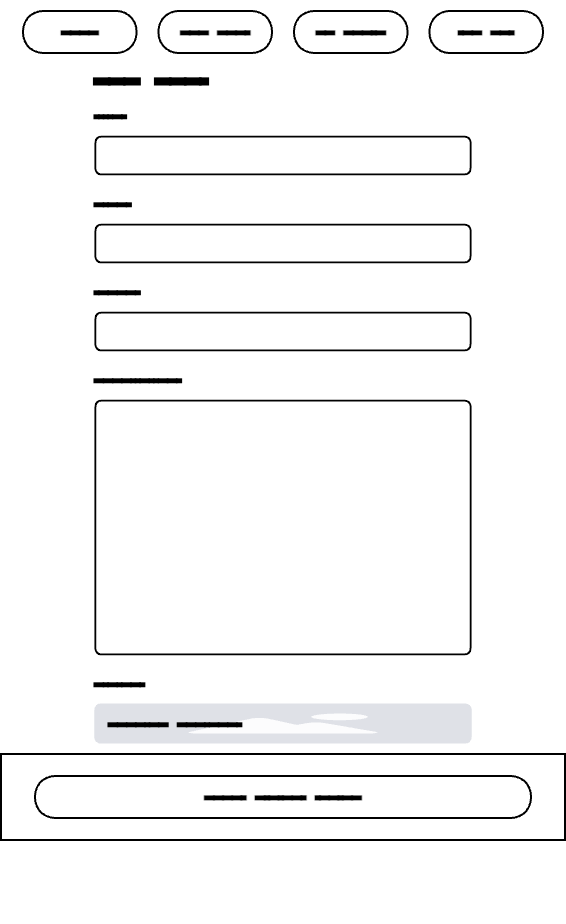</td></tr></table>

### Signup
<table><tr><td>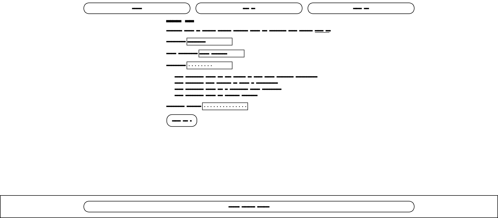</td><td>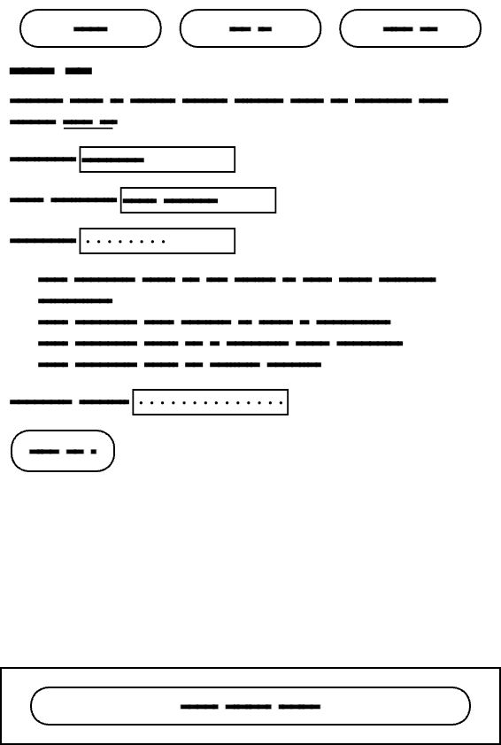</td></tr></table>

### Login
<table><tr><td>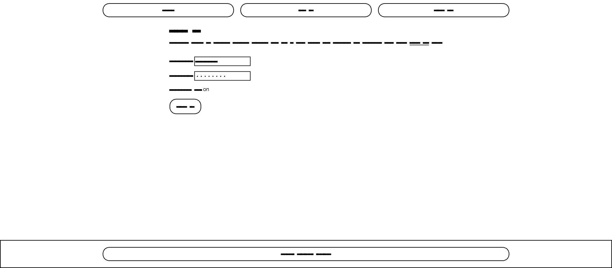</td><td>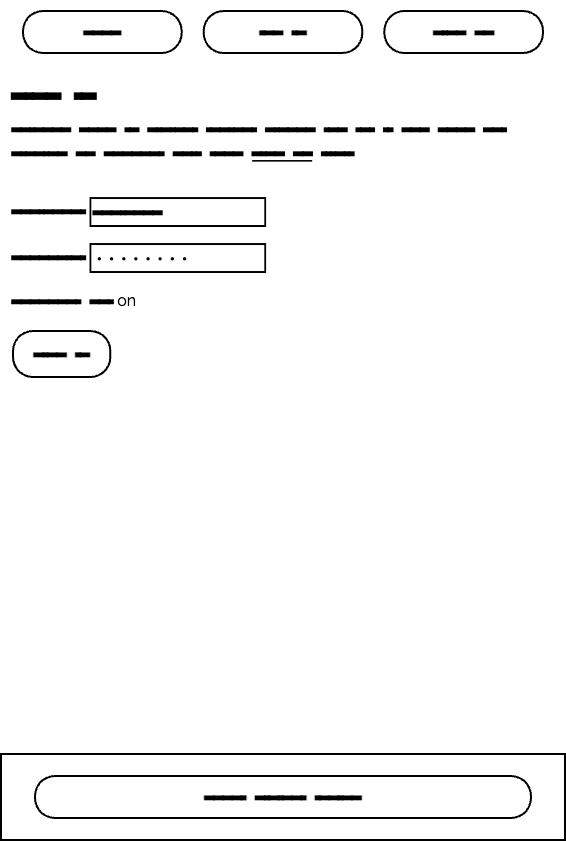</td></tr></table>

[Home](#overview)

## Brand Identity
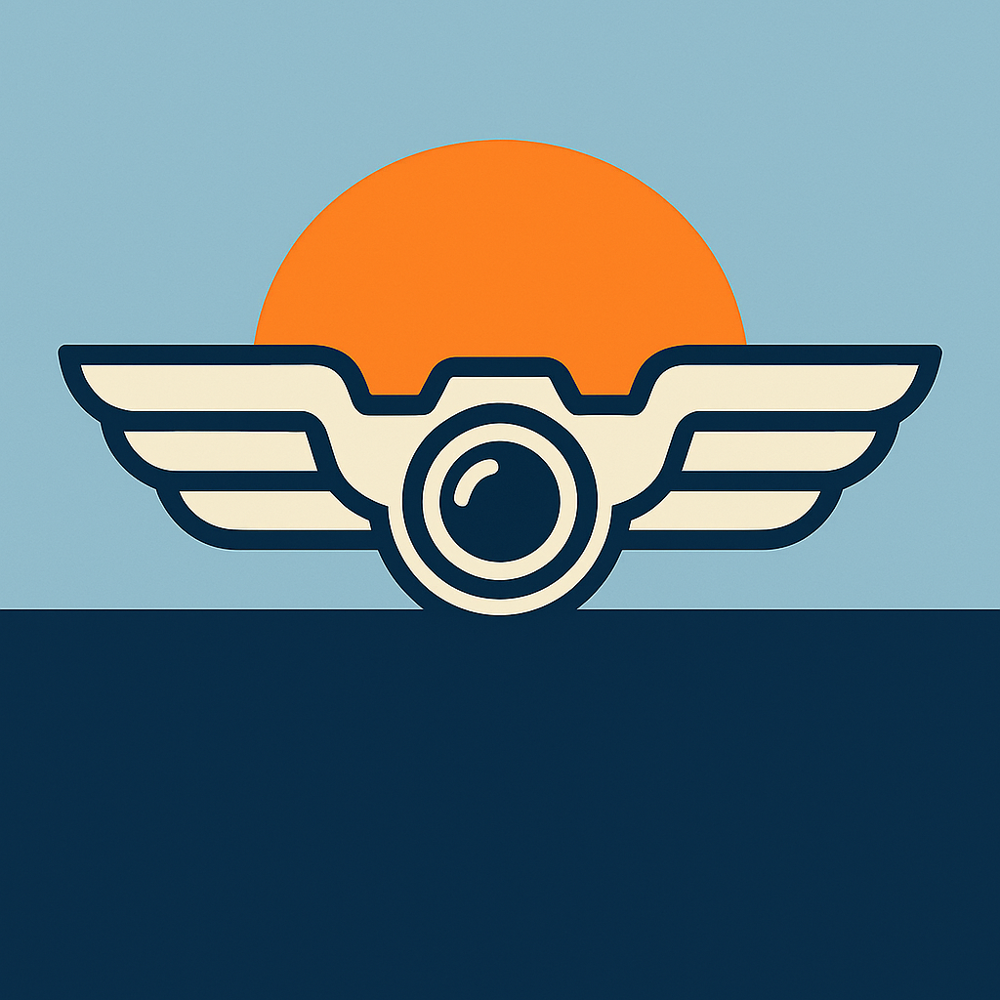

The Logo for Project Icarus references the dual nature, with the wings and sun over the ocean recalling Icarus flying too close to the sun, and the stylised camera lens referencing the project's nature as a photo-sharing platform. This logo was created by Microsoft Copilot, and a variation showing only the wings is used as the favicon for the site.

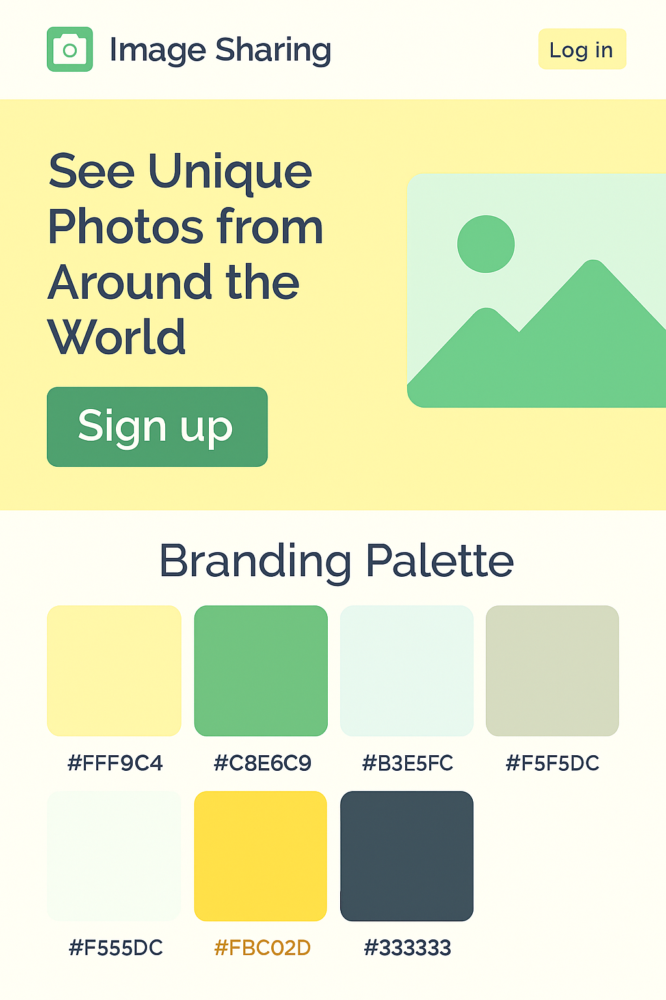

The color scheme for Project Icarus was also developed in conjunction with Microsoft Copilot. As mentioned further up in this readme, this palette of mellow greens and yellows was chosen to create a calm atmosphere when browsing the website, whilat also ensuring oa strong contrast to enhance accesibility on the website. The rounded corners used to further enhance this qwere also inspired by Microsoft Copilot.

[Home](#overview)

# Deployment

Project Icarus was first deployed via Heroku on November 27th, 2025. The process for deployment was as follows:

1. Verify project meets all prertequisites for deployment (Procfile present, etc.)
2. Create new app on Heroku
3. Link Heroku with github repo for project
4. Set up Config VARS for database & external image hosting
5. Deploy branch manually from Heroku
6. Pray to the machine spirit ;)
7. Manually deploy every time a major change is pushed to github

I found this process to be straightforward once I got into the swing of things. Unlike during the guided project that immediately preceded Project Icarus, I did not encounter a single vdatabase issue this time around.

[Home](#overview)

# AI Usage Disclosure

Microsoft Copilot was instrumental in the creation of Project Icarus. It was used extensively both in the preparation of this project and in troubleshooting and fixing bugs. Throughout this project, I've been battling with a suspected neurological issue that at times rendered my hands near useless, and so Copilot was crucial in acting as an accessibility tool during those times as well as for general bugfixing.

[Home](#overview)

# Testing

Testing of all major functionalities was done continuously during the development process, utilising twob different user accounts, one created via Terminal command and the other using the sign-up functionality on the website itself. 

## HTML & CSS Validation

### HTML
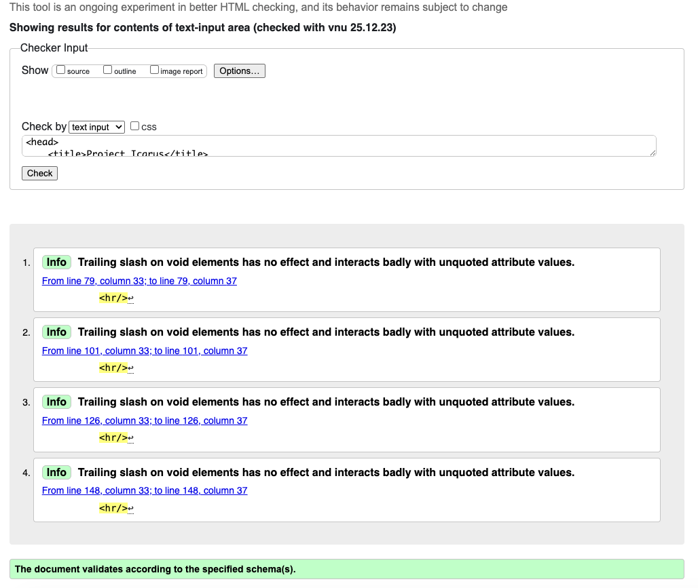

### CSS
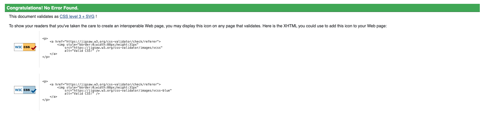

## Lighthouse & Wave

### Lighthouse
<table><tr><td>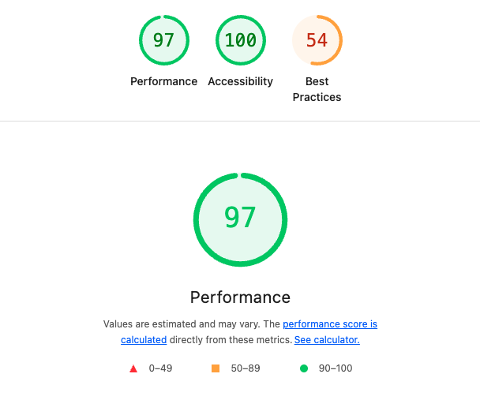</td><td>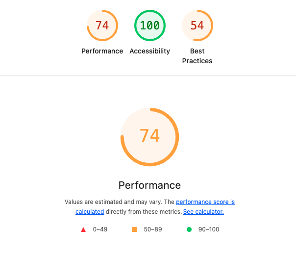</td></tr></table>

Performance scores for the mobile site are lower than I'd like due to the use of full-size image files. On a related note, the low Best Practices score primarily results from external image handling via Cloudinary.

### Wave

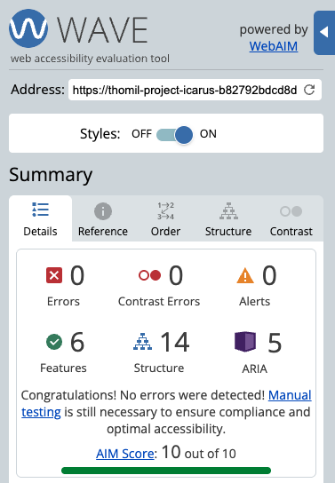

## Python pep8 Testing

Models, Views, and other python files were validated through Code Institute's linter tool. There were some warnings about lines of code being too long, however, these mostly related to settings.py, so while I don't consider the results to be perfect, they are bwithin acceptable parameters.

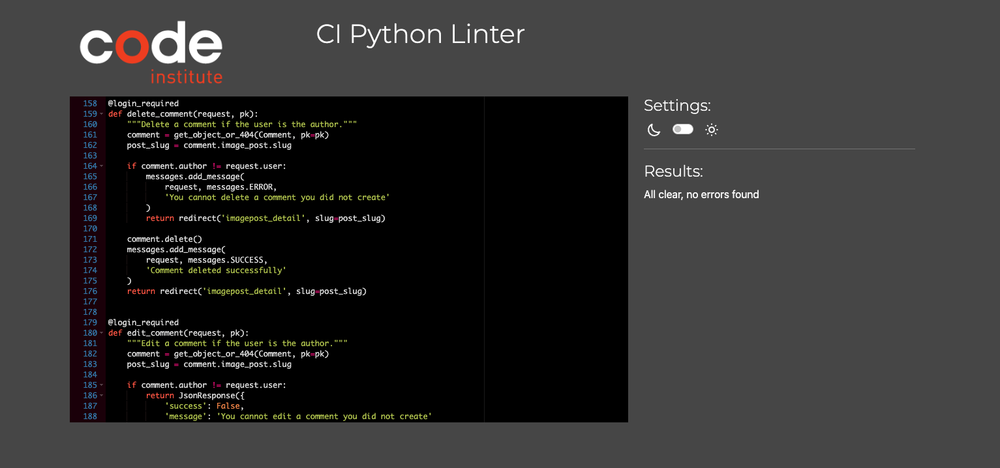

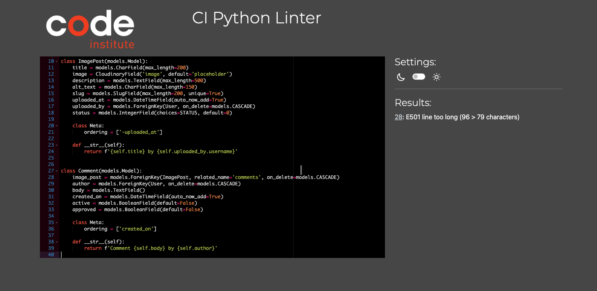

[Home](#overview)

# Future Additions

## Near Term

- Implementation of login, signup, new post and new comment functionality as modals, rather than as separate pages
- Implementation of 3rd-party & social media login
- Interface redesign to scale down pictures in Image Feed

## Long Term

- Implement Gallery functionality
- Change interface to emulate "Cover Flow" image scrolling
- Implement full user profiles and profile pages
- Add Two-Factor-Authentication
- Add login via hardware tokens (Yubikey)

# Credits

All images used in this project bearing the watermark of the author were either taken by me personally or by a family member of mine and are sourced from my family's photo library.

The Project Icarus Logo and favicon were generated by Microsoft Copilot.

Project Icarus was adapted from the foundation of Code Institute's Codestar blog, which served as a starting point and an inspiration for the general layout and approach.

Special thaks to the tutors, instructorsandother staff at Code Institute, as well as to my classmates in the bootcamp. I literally wouldn't have made it this far without your support!

The bytes used in the creation of Project Icarus were responsibly sourced from free-range memes and organically harvested spam emails.
